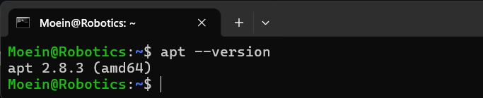
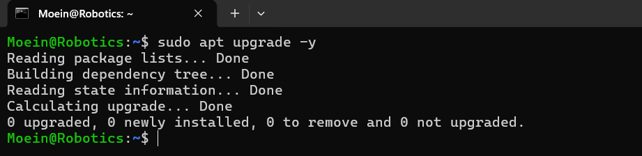
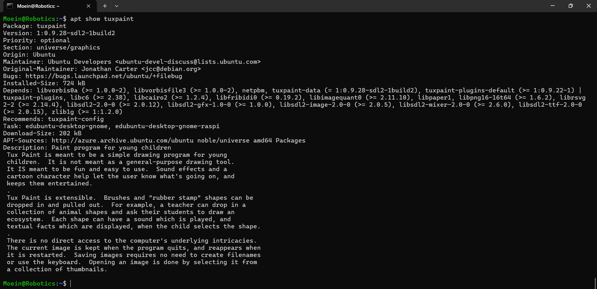
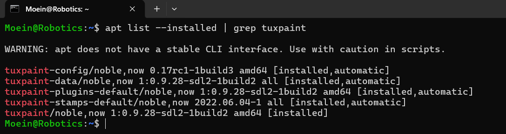
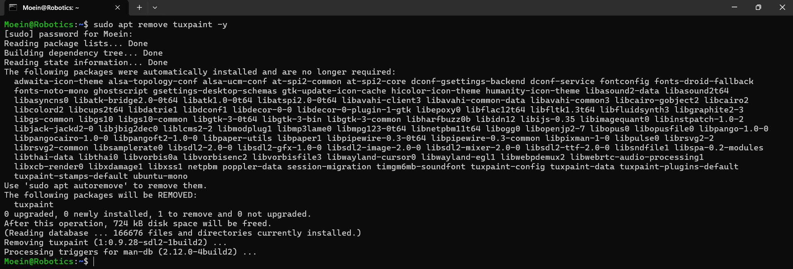
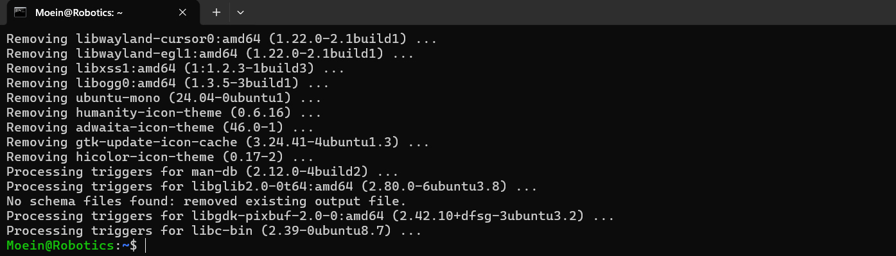
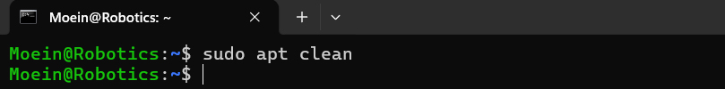
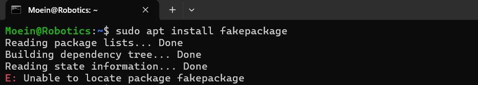
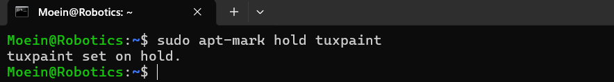

# APT Management Assignment Report

## Introduction
This report documents the practical steps taken to manage software packages on Ubuntu Linux using the **Advanced Package Tool (APT)**. APT is like a smart librarian that helps us find, install, and update software while handling dependencies automatically.

---

## Roadmap (Execution Plan)

### Part 1: System Updates
* Checking the APT version.
* Updating and upgrading the system.

### Part 2: Software Management
* Searching for new software packages.
* Installing a package and checking its details.

### Part 3: Cleaning & Removal
* Deleting software and its configuration files.
* Clearing unnecessary files from the system cache.

### Part 4: Repositories & Troubleshooting
* Managing software sources (Repositories).
* Fixing common installation errors.

## Part 1: Understanding APT & System Updates

### 1. Checking APT Version
I ran the following command to see the installed APT version:

**Command:**
`apt --version`

**Output:**

---

### 2. Updating Package List
I updated the catalog of available software from the repositories.

**Command:**
`sudo apt update`

**Why is this important?**
This step is crucial because it fetches the latest information about software versions and security patches from the servers. Without it, the system won't know if a newer version is available.

---

### 3. Upgrading Packages
I installed the available updates discovered in the previous step.

**Command:**
`sudo apt upgrade -y`

**Difference between Update and Upgrade:**
- **Update:** Refreshes the local database of available packages (checks the catalog).
- **Upgrade:** Actually downloads and installs the newer versions of the software (buys the books).

---

### 4. Viewing Pending Updates
To see which specific packages are ready for an upgrade, I used:

**Command:**
`apt list --upgradable`

**Output:**

## Part 2: Installing & Managing Packages

### 5. Searching for a Package
I searched for an image editor using the following command:

**Command:**
`apt search image editor`

**Selection:**
I chose **`tuxpaint`** from the list.

---

### 6. Viewing Package Details
I checked the details of `tuxpaint` to find its dependencies.

**Command:**
`apt show tuxpaint`

**Dependencies:**
It requires several libraries, including `tuxpaint-data`, `libc6`, and etc.

---

### 7. Installing the Package
I installed the package using the following command:

**Command:**
`sudo apt install tuxpaint -y`

---

### 8. Verifying the Installation
To verify the installation and check the version:

**Command:**
`apt list --installed | grep tuxpaint`

**Installed Version:**

## Part 3: Removing & Cleaning Packages

### 9. Uninstalling the Package
I removed the package using the following command:

**Command:**
`sudo apt remove tuxpaint -y`

**Is the package fully removed?**
The binary files are removed, but the configuration files remain on the system.

---

### 10. Purging Configuration Files
To completely remove the package and its settings, I used:

**Command:**
`sudo apt purge tuxpaint -y`

**Difference between Remove and Purge:**
- **Remove:** Only deletes the package binaries.
- **Purge:** Deletes the package binaries PLUS all configuration files.

---

### 11. Clearing Unnecessary Dependencies
I removed unused dependencies that were no longer needed by any software:

**Command:**
`sudo apt autoremove -y`

**Why is this step important?**
It helps to keep the system clean and saves disk space by removing libraries that are no longer in use.

---

### 12. Cleaning the Package Cache
Finally, I cleared the downloaded package archives from the local cache:

**Command:**
`sudo apt clean`

**What does this command do?**
It deletes the `.deb` files stored in `/var/cache/apt/archives/`, freeing up additional disk space.

## Part 4: Managing Repositories & Troubleshooting

### 13. Listing APT Repositories
I viewed the list of software sources configured on my system.

**Command:**
`cat /etc/apt/sources.list`

**What do you notice in this file?**
I noticed that the file is mostly empty and contains a notification stating that Ubuntu sources have moved to `/etc/apt/sources.list.d/ubuntu.sources`. This confirms that my system uses the new **deb822** format for enhanced security and clarity.

---

### 14. Adding the Universe Repository
I enabled the "Universe" repository to access more community-maintained software.

**Command:**
`sudo add-apt-repository universe`

`sudo apt update`

**What types of packages are found in the universe repository?**
The **Universe** repository contains free and open-source software maintained by the community. These are not officially supported by the Ubuntu core team.

---

### 15. Simulating Installation Failure
I attempted to install a non-existent package to observe the error handling.

**Command:**
`sudo apt install fakepackage`

**What error message do you get?**
`E: Unable to locate package fakepackage`.

**How would you troubleshoot this issue?**
1. Check for typos in the package name.
2. Run `sudo apt update` to refresh package lists.
3. Use `apt search <keyword>` to find the correct name of the package.
4. Ensure the necessary repository (like Universe or Multiverse) is enabled.

## Bonus Challenge: Holding and Unholding Packages

### 16. Holding a Package
I used the `apt-mark` command to prevent a specific package from being updated during a system upgrade.
**Command:**
`sudo apt-mark hold tuxpaint`

**Why would you want to hold a package?**
You would hold a package to maintain a specific version of software that is known to be stable or compatible with your current projects. This prevents an automatic `apt upgrade` from installing a newer version that might cause compatibility issues.

---

### 17. Unholding a Package
To allow the package to be updated again in the future, I used the unhold command:
**Command:**
`sudo apt-mark unhold tuxpaint`

**Result:**
The package is now back to its normal state and will be included in future system upgrades.
