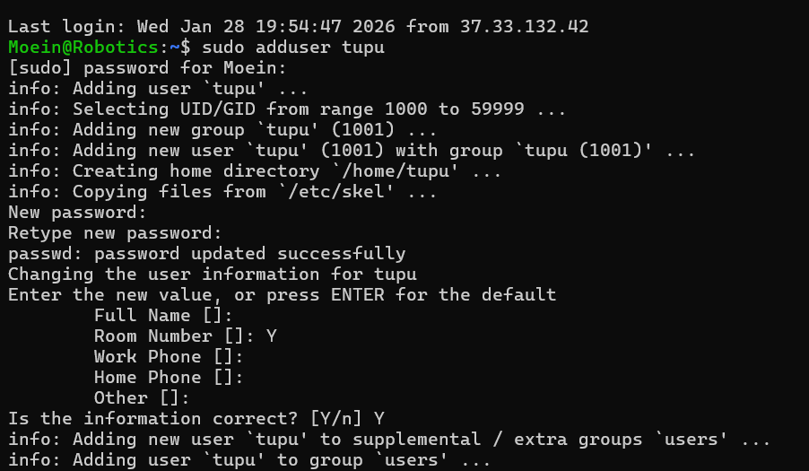
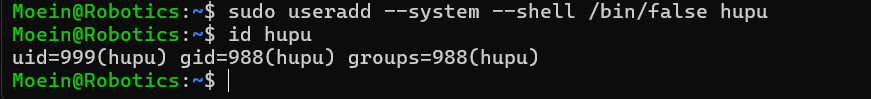
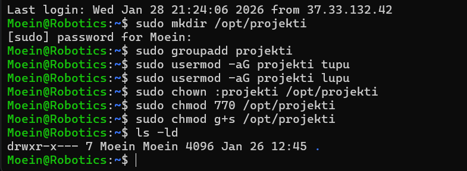

# User management and file system access
### Introduction
In Linux, managing users and controlling access to files is a fundamental task for system administrators. As we learned in the lectures, the Linux Kernel ensures security by restricting hardware and file access to authorized users only. This assignment focuses on creating different types of accounts, such as regular users and system users, and managing their permissions within the file system.

### Objective
In this task, I will demonstrate how to:

- Create new users using both adduser and useradd commands.
- Configure system accounts with restricted login shells.
- Manage administrative privileges by adding users to the sudo group.
- Set up a collaborative directory in /opt/projekti with specific group ownership and SetGID bits to ensure consistent file access for team members.

## Step 1: Creating User "Tupu" using adduser
In this step, I used the `adduser` script to create a new user named tupu. Unlike the basic useradd command, adduser is a high-level interactive tool that automatically creates the home directory and sets up the user environment.

### Implementation
1. **Execute Command:** In the terminal (CMD connected to the server) type the following command:
   ```bash
   sudo adduser tupu
2. **Set a password:** After that, the following message will appear (**New password**), here you need to choose a desired password for the tupu user to log in to tupu in the future. Then it will ask again **Retype new password**, which you need to re-enter the same desired password.

3. **User Configuration:** The next questions (Full Name, Room Number, etc) are optional; you can skip them by pressing Enter. Finally, when it asks Is the information correct? press Y and then Enter.

> [!NOTE]
> **Note on Passwords:** During this process, I first authenticated myself using my sudo password. Then, I set a new, unique password for the user tupu as prompted by the script.
### Verification
The terminal output confirms that the user was added to the system, the group was created, and the home directory was successfully initialized at `/home/tupu`.


## Step 2: Creating User "Lupu" using useradd
In this step, I used the `useradd` command to create the second user, **lupu**. Unlike the high-level `adduser` script used previously, `useradd` is a low-level utility that requires manual configuration via flags. This exercise demonstrates how to manually define a user's home directory and login shell.

### Implementation
1. **Execute Command:** I used several flags to ensure the user profile matches the requirements:
   - `-m`: Creates the user's home directory.
   - `-d /home/lupu`: Specifies the custom path for the home directory.
   - `-s /bin/bash`: Sets the default login shell to Bash.
   ```bash
   sudo useradd -m -d /home/lupu -s /bin/bash lupu
2. Setting Password: Since `useradd` does not prompt for a password automatically, I set it manually using the `passwd` command:
   ```bash
   sudo passwd lupu
### Verification
I executed the `id lupu` command to verify that the user lupu was successfully created with the correct UID and primary group.


## Step 3: Creating System User "Hupu"
In this step, I created a **system user** named **hupu**. System accounts are different from regular user accounts; they are typically used to run services or background processes rather than for human interaction. To enhance security, these users are usually denied terminal access.

### Implementation
1. **Execute Command:** I used the `useradd` command with specific flags to define the system nature of this account:
   - `--system`: Tells Linux to create a system account (usually with a lower UID).
   - `--shell /bin/false`: Sets a non-existent shell. If anyone tries to log in as **hupu**, the system will immediately reject the connection.
   ```bash
   sudo useradd --system --shell /bin/false hupu
### Verification
I verified the account creation using the `id hupu` command. As expected for a system user, the assigned UID is lower than those of the regular users (Tupu and Lupu).



## Step 4: Granting Sudo Privileges
By default, newly created users do not have administrative privileges. To allow **tupu** and **lupu** to execute commands with root authority, I added them to the **sudo** group. This is a secure way to manage administrative access without sharing the root password.

### Implementation
1. **Adding Users to Sudo Group:** I used the `usermod` command with the `-aG` flags (Append to Group) to ensure their existing group memberships remained intact while adding the new privilege.
   ```bash
   sudo usermod -aG sudo tupu
   sudo usermod -aG sudo lupu
### Verification
I verified the changes by checking the group memberships of both users. As shown in the terminal, both users are now part of the `sudo` group.
   ```bash
   groups tupu lupu
```


## Step 5: Creating a Collaborative Directory with SetGID
The final task was to create a shared directory at `/opt/projekti` where only **tupu** and **lupu** have full access. To achieve this, I implemented a group-based permission strategy using the **SetGID (Set Group ID)** bit. This ensures that any new files created within this directory automatically inherit the group ownership of the parent folder, allowing seamless collaboration.

### Implementation
1. **Directory and Group Creation:** I created the folder and a dedicated group named `projekti`.
   ```bash
   sudo mkdir /opt/projekti
   sudo groupadd projekti
2. **Membership:** I added both users to the new group.
   ```bash
   sudo usermod -aG projekti tupu
   sudo usermod -aG projekti lupu
3. **Ownership and Permissions:** I changed the group ownership of the directory and set the permissions to `770` (Full access for Owner and Group, no access for Others).
   ```bash
   sudo chown :projekti /opt/projekti
   sudo chmod 770 /opt/projekti
4.**Enabling SetGID:** I applied the `g+s` bit to maintain group consistency for future files.
   ```bash
   sudo chmod g+s /opt/projekti
 ```

### Verification
As shown in the verification command `ls -ld /opt/projekti`, the directory has the correct group ownership, and the 's' bit is clearly visible, confirming the successful configuration of SetGID.



