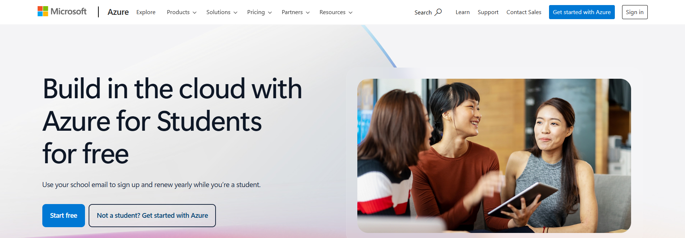
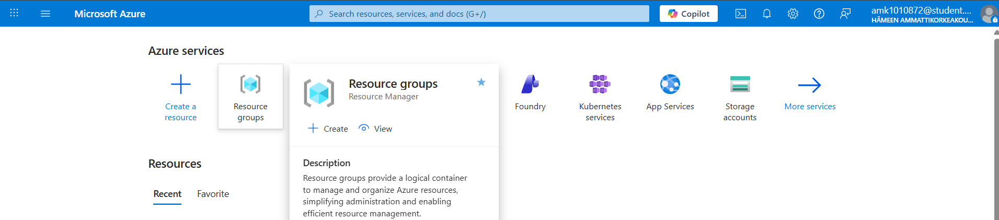
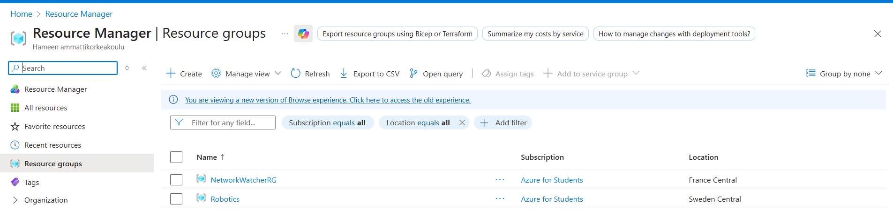
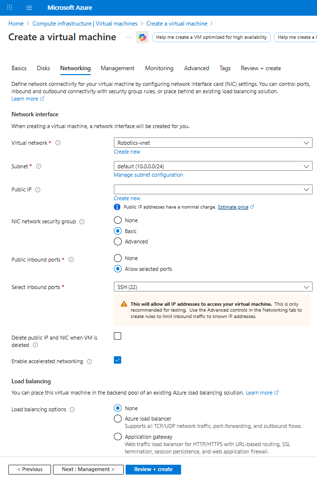
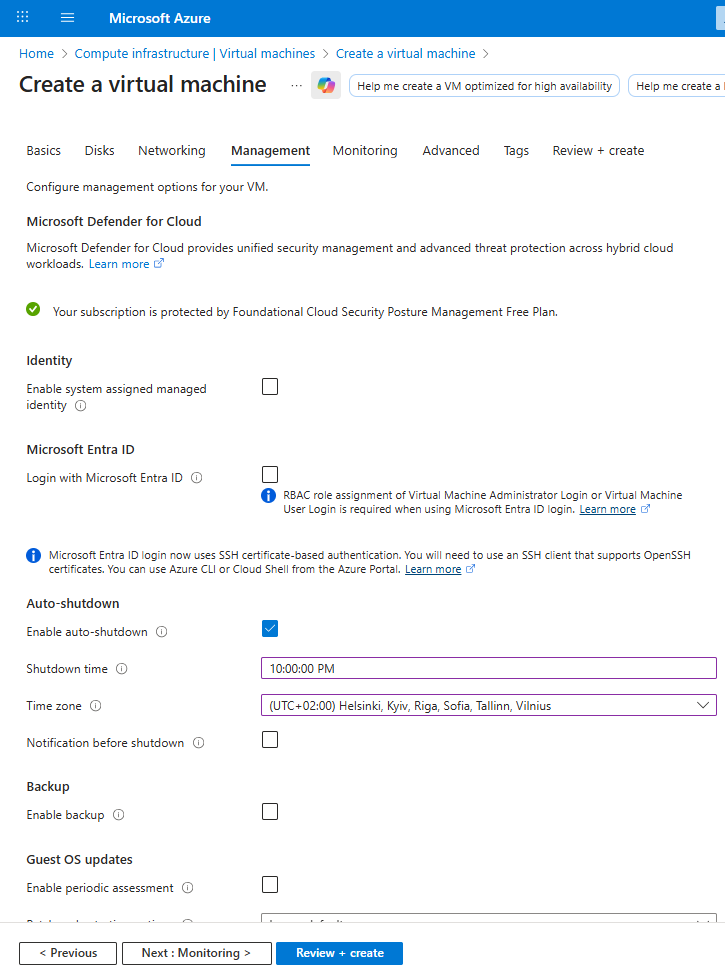
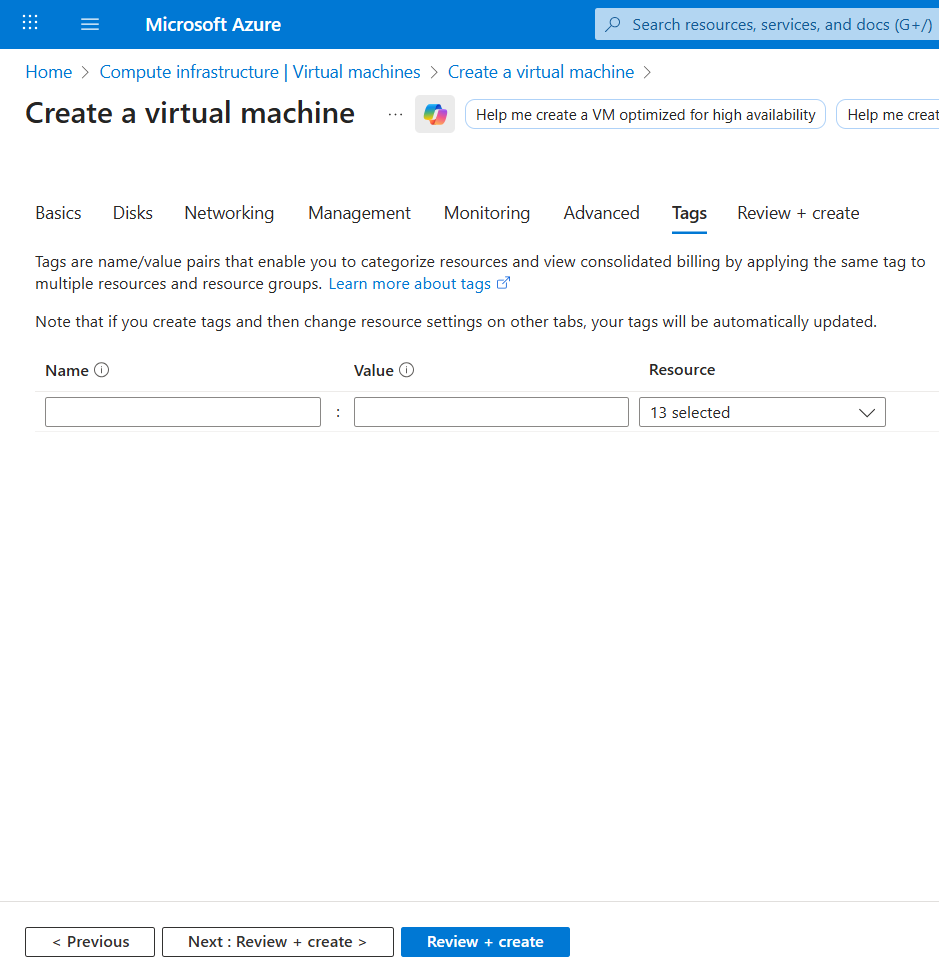
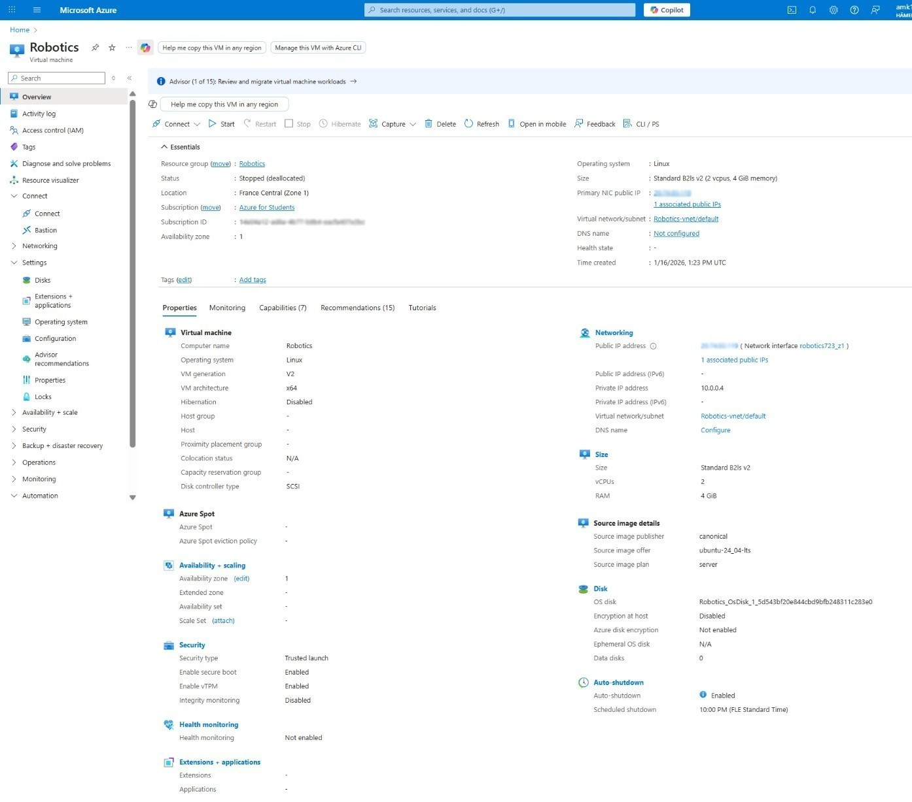
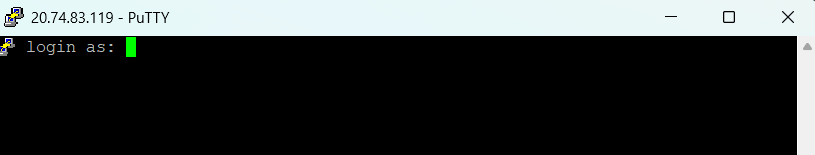

# Virtual Machine Creation
To be able to do Linux exercises, we need a Linux machine. Hence, we use public cloud virtual machines from Microsoft Azure cloud to be doable at any time and place. To create a Linux virtual machine, we must follow the following instructions:
1. Login to [portal.azure.com](https://portal.azure.com/) using HAMK student id
2. To receive student credits, request credit from [Azure](https://azure.microsoft.com/en-us/free/students/) to receive $100 in credit by clicking Get _**"Started Free"**_. By clicking on it, we need to log in with our student account and enter a form of our information. This step is necessary not only to receive the credit but also to join the class group (when creating the virtual machine).
   
Once we've been accepted into your Azure for Students subscription, we can create a new virtual machine for ourselves. We'll go to our portal home page, portal.azure.com, and create a new resource, a virtual machine, with the following settings:
3. By clicking on “Resource groups” and then create, we can connect to the lesson group and assign a name to it. Finally, we click on Review+Create.
   
   
At the end, the created Resource groups can be seen as follows.
   
4. Then, by returning to Home and clicking on Virtual Machine, Create and selecting Virtual Machine, we enter the creation stage.
      
The settings the Azure VM provisioning wizard displays in the Azure portal are grouped into the following pages:
    - Basics
    -	Disks
    -	Networking
    -	Management
    -	Monitoring
    -	Advanced
    -	Tags
      1) <ins> **Basics** </ins>: The settings on this page configure the target subscription, either an existing or new resource group, and the Azure region where the Azure VM and the resources   on which it depends will reside. From here you also specify:
          -	The Azure VM name.
          -	Availability options.
          -	The OS image.
          -	Administrator account name.
          -	Depending on your choice of the authentication type, either the corresponding password or the secure shell protocol (SSH) key.
            

      2) <ins> **Disks** </ins>: You can use the Disks tab to specify the type and encryption of the disk hosting the Azure VM OS. You can also attach one or more data disks, although this option is available at any point following the deployment. The maximum number of data disks that an Azure VM supports depends on its size.
           
      3)  <ins> **Networking** </ins>: Every Azure VM uses its network interface to attach to a virtual network's subnet. Therefore, having a virtual network with at least one subnet is a prerequisite when provisioning an Azure VM.
           
      4)  <ins> **Management** </ins>: From the Management tab, you can enable several optional settings to enhance your Azure VM's manageability. These settings control support for Microsoft Defender for Cloud and Microsoft Entra authentication. You can also use them to enable schedule-based auto-shutdown, automatic backups, and patch orchestration.
            
      5)  <ins> **Monitoring** </ins>: You use the Monitoring tab to enable monitoring settings. These include automatic alerts that notify you about potential resource utilization issues and boot and operating-system diagnostics.
             
      6)  <ins> **Advanced** </ins>: This tab provides miscellaneous options that allow you to further customize platform and operating system-level settings of the Azure VM that are deploying.
             
      7)  <ins> **Tags** </ins>: You can use this tab to create descriptive labels (tags) that you want to assign to the resource. Tags help organize resources based on your own custom criteria.
             
      8)  <ins> **Review + create** </ins>: After completing the configuration steps in the various pages of the provisioning wizard, you'll reach the final tab, Review + create. At this point, the Azure portal will automatically invoke a validation task, which verifies that the options you've selected are valid. If you've misconfigured a setting or missed a required one, you'll have a chance to go back to the corresponding page to fix your mistake. When you return to the last page, validation will run again.
         
>[!IMPORTANT]
>When you select the SSH Public Key option during the virtual machine creation stage, in the last step (before hitting the final Create button), a window will open asking you to download the Private Key. The file is usually something like Robotics_key.pem.

Below you can see the general settings of the virtual machine.

# SSH client (eg. PuTTY) 
Try logging in after machine creation is successful Connect: Use an SSH client (eg. PuTTY) to connect to your virtual machine. You can download PyTTY safely, from [the website](https://www.chiark.greenend.org.uk/~sgtatham/putty/latest.html) of the publisher of the program. We recommend installing the 64-bit x86 MSI package of PuTTY, which also installs other necessary tools. Use the username and password or username and ssh key that you specified during installation. The connection and testing section is not completed, so we need to perform the following steps:
1)	IP Address: Note down your public IP address on the virtual machine.
2)	Start the device: click the Start button at the top of the screen to change the device status to Running.
3)	Connect via SSH (the most important part): Connect to the device using the PuTTY software.
PuTTY software: Open it, enter the above IP in the Hostname field, and set the port to 22.
4)	Username and Password: When you created the device, you specified a username and (possibly) password. When the black PuTTY window opens, enter them.

> [!TIP]
> If you created an SSH key instead of a password, you will need to enter the key file (.ppk) in the PuTTY settings (Auth section). There is one technical point: PuTTY cannot use a .pem file directly, and you need to convert it to its own format, .ppk. To do this, follow these steps:

## Step 1: Convert PEM to PPK (using PuTTYgen)
-	Open PuTTYgen (it comes installed with PuTTY).
-	Click the Load button.
-	In the window that opens, change the file type from (*.ppk) to All Files (.) so that you can see the Robotics_key.pem file and select it.
-	A message will appear saying that the key was successfully imported. Click OK.
-	Now click the Save private key button. A warning will appear about not having a password, which you can click Yes.
-	Save the file with a name of your choice (e.g. Robotics.ppk) in a safe place.
  
## Step 2: Connect to the VM (using PuTTY)
Now that you have the .ppk file, follow the steps in the tutorial:

-	First, make sure your VM is Running in the Azure panel.
-	Open PuTTY.
-	In the Host Name (or IP address) field, enter your machine's IP address: (Your Public IP)
-	From the left-hand tree menu, navigate to: Connection > SSH > Auth > Credentials
-	In the Private key file for authentication field, click the Browse button and select the file you created in the previous step (Robotics.ppk).
-	Go back to the top of the menu and click Session and click the Open button.
-	A black window will open. If you get a warning, click Accept or Yes.
  
 	
When the login as: prompt appears, type the username you specified when creating the VM and press Enter.
  
  
If everything is correct, you will be logged into the Linux terminal.
  

> [!NOTE]
> Some tips for managing costs and credit:
> -	<ins> **Auto-shutdown:**</ins> I see in the image that the auto-shutdown feature is enabled for 10pm. This is very smart so that you don't run out of credit.
> -	<ins> **Manual shutdown:**</ins> Whenever you are done with Linux, be sure to click the Stop option from within the Azure panel.
